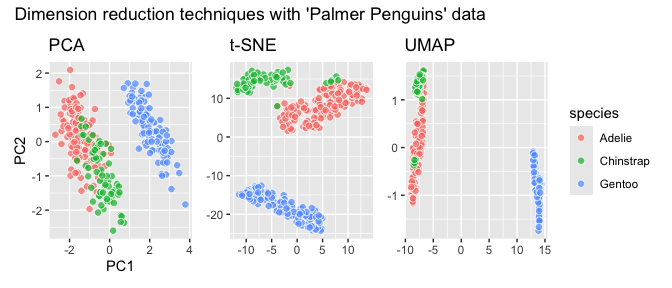
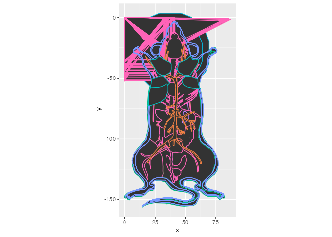
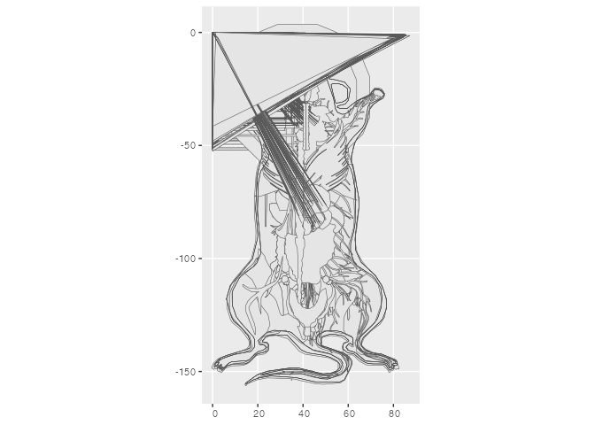
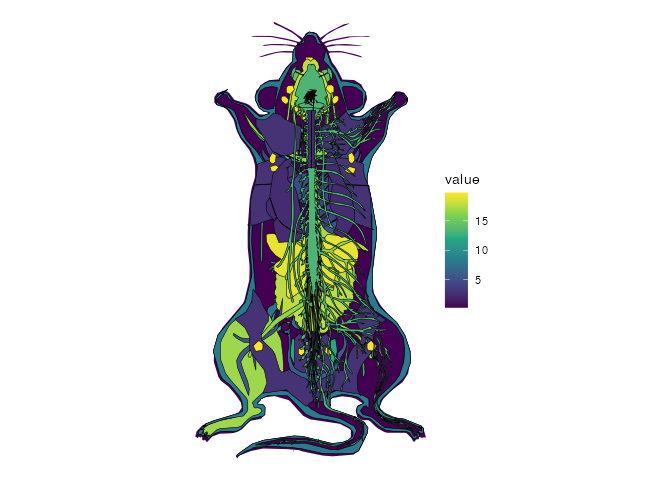

# 👋 Thanks for dropping by!

Stuff I do:

- [x] Descriptive Statistics, Statistical Modeling, Machine Learning
  (with emphasis on viz)
- [x] Visualization (ggplot2, plotnine, Tableau), Table Generation
  (tidypivot, gt, greattables, flextable)
- [x] Dashboarding (Experience with Shiny, powerBI, Tableau)
- [x] Research Reporting (Scholarly, Institutional; Rmarkdown, Quarto)
- [x] Workflow/Pipeline Management (tidyverse, base R, SQL)
- [x] Research Software Engineering (experienced R package maintainer,
  \> 5 years)
- [x] Statistical Consulting
  <!-- - [x]  Technical Communication (oral and written) -->
- [x] Data Science Education (excellence in class, and world wide)
- [x] Version Control, Collaborative Workflows, Git, Github, Github
  Actions
- [x] Productive, Professional, and Friendly Working Relationships with
  Collaborators with diverse technical and subject area backgrounds
- [x] Tidyverse Fluency (dplyr, ggplot2, tidyr, purrr, etc)
- [x] R Packaging Expertise (workflow tools, documentation, testing)
- [x] Visualization Frameworks (spatial, network, grammar of graphics,
  ggdims)
- [x] Contributor to popular open source libraries (ggplot2, plotnine)
- [x] Author, maintainer of popular libraries (flipbookr, ggcirclepack)
- [x] Experience with CRAN submission process and maintanance
  (flipbookr, tidytitanic)

<!-- Bachelor's degree in software development or a directly related field from an accredited institution. -->

<!-- Three (3) years of software development, software or system engineering, bioinformatics, or directly related IT professional experience. -->

<!-- Two (2) years of experience in data analysis using R with common analysis utilities (Tidyverse, dplyr, etc.). -->

<!-- Two (2) years of experience with manipulating large datasets to transform, profile, sanitize, explore, analyze, and present information in a reproducible way. -->

<!-- Two (2) years of experience with version control, preferably with Git -->

<!-- Experience developing and deploying reusable and robust R packages, including familiarity with testing frameworks (testthat) and documentation generation (roxygen2). -->

<!-- A combination of education and related technical/military/paraprofessional experience may be substituted for a bachelor’s degree on a year for year basis. An advanced degree (Masters or Doctorate) may be substituted for experience on a year for year basis if the degree is in a field of study directly related to the work assignment. -->

<!-- - [x]  Reproducible computing environments, containerization -->

I work on tools that make data analytics more fluid and intuitive and on
tools which expose this fluidity and elegance. These tools also allow us
to better record ‘conversations’ with data and workflows.

<!-- ```{r} -->

<!-- ``` -->

<!-- exported functions: last_plot_data, data_unfilter, data_slice_sample, data_refilter, aes_dims, data_var_split, data_include, data_filter, data_arrange, dims_unpack, data_replace, last_plot_wipe_last, last_plot_wipe, data_slice_max, intercept, dims0, aes_from_data, data_slice -->

<!-- tidypivot - -->

<!-- exported functions: `getNamespaceExports("tidypivot")` -->

<!-- ggdims - -->

<!-- exported functions: StatTsneGroup, theme_ggdims, compute_pca_rows, dims, compute_tsne_group_label, GeomPointFill, geom_tsne_label, StatPcaRows, geom_pca, StatTsne, geom_umap0, geom_tsne_label0, geom_pca0, compute_umap, vars_unpack, geom_tsne, data_vars_unpack, geom_tsne0, compute_tsne, dims_listed, geom_umap, dims_expand, StatUmap -->

<!-- ggregions - write_stamp_region_locale, write_geom_region_locale, write_stamp_region_text_locale, write_geom_region_text_locale, compute_panel_regions -->

<!-- statexpress - proto_update, qstat_group, qproto_update, qstat, qstat_panel, qstat_layer, qlayer -->

<!-- Record conversations: -->

<!-- ggprop.test - geom_normal_prop_null_sds, geom_support, geom_prop, geom_normal_prop_null, geom_stack, stamp_prop, geom_prop_label, stamp_eq_norm_prop, geom_stack_label, stamp_prop_label -->

<!-- Expose this fluidity and elegance: -->

<!-- flipbookr - embed_flipbook, text_reveal, %>%, create_base_pipe_code, return_chunk_code, chunk_reveal, reveal_live -->

<!-- ggram - -->

<!-- Education: -->

<!-- easy-geom-recipes -->

<!-- easy-geom-recipes-python -->

<!-- easy.geom.recipes.package -->

<!-- knitrExpress -->

My popular projects include
[flipbookr](https://github.com/EvaMaeRey/flipbookr) (on CRAN and
maintained since 2020, with \>20000 downloads and used across
disciplines) and ggplot2 extensions like
[ggcalendar](https://evamaerey.github.io/ggcalendar/),
[ggcirclepack](https://github.com/EvaMaeRey/ggcirclepack) and others.

Professionally, I’ve worked in higher education and government where my
work involved analytics, teaching, and policy implementation.

I’m interested in lightening cognative load, first, when interpreting
data visualizations and, second, when writing and reading code used to
build data visualizations. I believe intuitiveness of plot composition
tools (coding and gui interfaces) often translates to more effective
visualization. With logical, easy-to-use tools, we’re better positioned
to build compelling, easy-to-interpret visualizations, rather than
stopping at ‘good enough’. For these reasons, I’m a big fan of the
elegant and intuitive grammar of graphics visualization frameworks.

My technical expertise is in ggplot2 and my current focus is on
extension and supporting extenders. I co-founded and organize the
[ggplot2 extenders
club](https://ggplot2-extenders.github.io/ggplot-extension-club/)…

, have created [‘easy geom
recipes’](https://evamaerey.github.io/easy-geom-recipes/), am writing
[ggplot2 extension
cookbook](https://github.com/EvaMaeRey/ggplot2-extension-cookbook), and
developing [‘express’ methodologies for
extension](https://github.com/EvaMaeRey/ggexpress) (why shouldn’t
everyone be using extension and why shouldn’t we be using them even on
an *ad hoc* basis?).

I’ve studied some of these new educational materials via [survey
response and focus
groups](https://evamaerey.github.io/easy-geom-recipes/survey_results_summary.html).
For more on the motivation for these efforts, see [‘everyday ggplot2
extension’](https://evamaerey.github.io/everyday_ggplot2_extension/).

I’m interested in the transformational effects that access to tailored,
principled data visualization tools can have on analytic and teaching
spaces. I work on greater accessibility for analysts, research, and
students to craft tool suited to their particular data challenges.

Previously, I had a greater focus on illuminating the grammar of *base*
ggplot2, creating materials like [a ggplot2 grammar
guide](https://evamaerey.github.io/ggplot2_grammar_guide/about) and [the
ggplot2
flipbook](https://evamaerey.github.io/ggplot_flipbook/ggplot_flipbook_xaringan.html#1).

I am also especially interested in entry points to R package writing,
working on resources like a [’companion
guide](https://evamaerey.github.io/package_in_20_minutes/package_in_20_minutes)
to to Jim Hester’s talk how to write and R package in 20 minutes’ (2000)
I have also looked comparatively at literate package writing tools of
[{fusen}](https://thinkr-open.github.io/fusen/),
[{litr}](https://jacobbien.github.io/litr-project/), and my own
‘readme-to-package’ approach, including via an coordinating a virtual
meeting with the authors at RLadies Denver, [March 2024
meeting](meetup.com/rladies-denver/events/299879858/?eventOrigin=group_past_events).
The [note package (2025)](https://github.com/musician-tools/note) uses
my [{knitrExtra}](https://github.com/EvaMaeRey/knitrExtra) package to
create the note package (a lightly rewritten version of what Jim Hester
presented) from within a README.

Some work projects that are especially motivating:

1.  [{ggdims}](https://github.com/EvaMaeRey/ggdims): a framework for
    dimension reduction in the ggplot2 grammar.

This project breaks new ground in the ggplot2 ecosystem so that
‘aggregation’ can be as easily handled across *features* (columns) as it
is to aggregate across samples (rows).

``` r
library(ggplot2)
library(ggdims)

pca <- penguins_normalized |>
  ggplot() + 
  aes(dims = dims(bill_len:body_mass),
      fill = species) +
  geom_pca() 

tsne <- penguins_normalized |>
  ggplot() + 
  aes(dims = dims(bill_len:body_mass),
      fill = species) +
  geom_tsne() 

umap <- penguins_normalized |>
  ggplot() + 
  aes(dims = dims(bill_len:body_mass),
      fill = species) +
  geom_umap() 
  
library(patchwork)
pca + labs(title = "PCA") + 
  tsne + labs(title = "t-SNE") + 
  umap + labs(title = "UMAP") + 
  plot_layout(guides = "collect") + 
  plot_annotation(title = "Dimension reduction techniques with 'Palmer Penguins' data")
```

<!-- -->

2.  [{ggregions}](https://github.com/EvaMaeRey/ggregions)

The ggregions changes how analysts can interact with [simple
features](https://en.wikipedia.org/wiki/Simple_Features) (sf) data.
Specifically it provides utilities that allow package authors to quickly
and cleanly create region-aware `geom_*()` functions (smart layers).

Writing a new region-aware geom with ggregions is simple:

``` r
us_states_ref <- usmapdata::us_map() |> 
  select(state_name = full, 
         state_fips = fips, 
         state_abb = abbr, 
         geometry = geom)

geom_state <- ggregions::write_geom_region_locale(ref_data = us_states_ref)
```

Then, user experience is very intuitive. The user can graph
geo-referenced data in an intuitive way with smart layers like
geom_state() — borders are added under the hood!

``` r
# geo data without boarder info
head(us_rent_income) 
```

    ## # A tibble: 6 × 5
    ##   GEOID NAME    variable estimate   moe
    ##   <chr> <chr>   <chr>       <dbl> <dbl>
    ## 1 01    Alabama income      24476   136
    ## 2 01    Alabama rent          747     3
    ## 3 02    Alaska  income      32940   508
    ## 4 02    Alaska  rent         1200    13
    ## 5 04    Arizona income      27517   148
    ## 6 04    Arizona rent          972     4

``` r
# plot
us_rent_income |> 
  filter(variable == "rent") |> 
  ggplot() + 
  aes(state_name = NAME, 
      fill = estimate) + 
  geom_state() +  
  scale_fill_viridis_c()
```

<!-- -->

Notably, this framework may also be used with other atlas types, for
example anatomical atlases.

## teethr’s data experiment

<https://github.com/bbartholdy/teethr>

<details>

``` r
library(tidyverse)
library(teethr)
teeth_ref_data <- dental_arcade_mapping |> 
  as_tibble() |> 
  left_join(tooth_notation |> 
  select(tooth = text, fdi = FDI, standard = standards) 
  )

caries_ratios <- mb11_caries %>% 
  dental_longer(-id) %>%
  dental_join() %>% 
  count_caries(caries = score, no_lesion = "none") %>% # convert location to lesion count
  group_by(tooth) %>% 
  dental_ratio(count = caries_count) %>%
  dental_recode(tooth, "FDI", "text") 
```

``` r
head(teeth_ref_data)  # are there other ids?  like just number of tooth?
```

    ## # A tibble: 6 × 4
    ##   tooth                                                  geometry fdi   standard
    ##   <chr>                                                 <POLYGON> <chr> <chr>   
    ## 1 URM2  ((65.18537 293.3849, 65.71057 295.1088, 66.38935 296.496… 17    2       
    ## 2 URM1  ((74.4591 325.7847, 75.55431 326.5688, 76.88258 327.0586… 16    3       
    ## 3 URP2  ((76.59484 342.573, 77.43558 343.7596, 78.59217 344.6295… 15    4       
    ## 4 URP1  ((86.86233 359.6018, 86.86725 360.529, 87.02025 360.8659… 14    5       
    ## 5 URC1  ((101.1985 370.3966, 101.3456 371.2152, 101.6861 371.999… 13    6       
    ## 6 URI2  ((123.4955 387.3634, 123.4955 387.3634, 124.5163 387.779… 12    7

``` r
library(ggregions)
geom_tooth <- ggregions::write_geom_region_locale(teeth_ref_data)
geom_tooth_text <- write_geom_region_text_locale(teeth_ref_data)
stamp_tooth <- write_stamp_region_locale(teeth_ref_data)
stamp_tooth_text <- write_stamp_region_text_locale(teeth_ref_data)
```

</details>

### teethrXggregions resultant API

``` r
head(caries_ratios)
```

    ## # A tibble: 6 × 4
    ##   tooth     n count  ratio
    ##   <chr> <int> <dbl>  <dbl>
    ## 1 URI1     35     4 0.114 
    ## 2 URI2     31     4 0.129 
    ## 3 URC1     35     7 0.2   
    ## 4 URP1     34     3 0.0882
    ## 5 URP2     23     5 0.217 
    ## 6 URM1     32     7 0.219

``` r
caries_ratios |> 
  ggplot() + 
  aes(tooth = tooth, 
      fill = ratio) + 
  geom_tooth(alpha = .2) + 
  stamp_tooth_text(size = 2)
```

<!-- -->

# gganatogram’s data experiment

<https://github.com/jespermaag/gganatogram>

<details>

``` r
to_sf_routine <- function(data){
  
  data |>
  mutate(y = -y) |>
  sf::st_as_sf(coords = c("x", "y"), agr = "constant") |>
  group_by(id, group) |>
  summarize(do_union = F) |> 
  ungroup() |> 
  group_by(id, group) |>
  summarise() |>
  mutate(geometry = geometry |> sf::st_cast("POLYGON")) |> 
  mutate(geometry = geometry |> sf::st_cast("MULTIPOLYGON")) |> 
  ungroup() 
  
}
```

``` r
cell_sf <- gganatogram::cell_list[[1]] |> 
  bind_rows() |>
  remove_missing() |>
  to_sf_routine() |> 
  rename(organelle = id)
```

``` r
geom_organelle <- ggregions::write_geom_region_locale(cell_sf)
stamp_organelle <- ggregions::write_stamp_region_locale(cell_sf)

cell_sf
```

    ## Simple feature collection with 1088 features and 2 fields
    ## Geometry type: MULTIPOLYGON
    ## Dimension:     XY
    ## Bounding box:  xmin: 5.4 ymin: -483.4 xmax: 606.7 ymax: -8.4
    ## CRS:           NA
    ## # A tibble: 1,088 × 3
    ##    organelle       group                                                geometry
    ##    <chr>           <chr>                                          <MULTIPOLYGON>
    ##  1 actin_filaments 6_10  (((43.4 -268.8, 52.5 -250.1, 62.4 -231.9, 74.4 -214.6,…
    ##  2 actin_filaments 6_11  (((111 -398.1, 113.7 -400.7, 116.4 -403.2, 96.6 -396.2…
    ##  3 actin_filaments 6_12  (((112.1 -396.9, 112.6 -397.1, 113.2 -397.3, 121 -400.…
    ##  4 actin_filaments 6_13  (((170.7 -422.4, 175.3 -423.8, 179.9 -425.2, 184.8 -42…
    ##  5 actin_filaments 6_14  (((197.2 -430.3, 203.4 -432.1, 209.7 -433.9, 206.5 -43…
    ##  6 actin_filaments 6_15  (((554.9 -230.1, 554.3 -238.9, 553.9 -247.6, 537.5 -17…
    ##  7 actin_filaments 6_16  (((554.6 -192.2, 556.1 -196.3, 557.6 -200.4, 557.1 -20…
    ##  8 actin_filaments 6_17  (((557.9 -245.2, 559.4 -261.7, 560.9 -278.7, 559 -269.…
    ##  9 actin_filaments 6_18  (((523 -91.4, 531 -97, 537.9 -102.8, 543.2 -128.5, 547…
    ## 10 actin_filaments 6_19  (((512.7 -82.2, 512 -80.5, 511.3 -78.8, 519.4 -82.2, 5…
    ## # ℹ 1,078 more rows

</details>

``` r
ggplot() + 
  stamp_organelle(alpha = .2) + 
  stamp_organelle(keep = "actin_filaments", 
                  fill = "orange" |> alpha(.1)) +
  stamp_organelle(keep = "endoplasmic_reticulum", 
                  fill = "darkred") 
```

<!-- -->

# Trying female human anatomy with same routine

<details>

``` r
length(gganatogram::hgFemale_list)
```

    ## [1] 204

``` r
# fix so that all data frames can be combined with bind_rows
# the groups are numeric and character so using bind_rows fails
female_sf <- gganatogram::hgFemale_list[c(1:156, 180:195)] |> # return to this!!
  bind_rows() |>
  remove_missing() |>
  to_sf_routine() |> 
  rename(organ = id)
  
stamp_organ <- ggregions::write_stamp_region_locale(female_sf)

ggplot(female_sf) + 
  aes(geometry = geometry) +
  geom_sf(alpha = .2)
```

<!-- -->

``` r
male_sf <- gganatogram::hgMale_list[2:155] |>  
  bind_rows() |>
  # filter(x != 0, y != 0, y < -2) |>
  remove_missing() |>
  to_sf_routine() 


ggplot(male_sf) + 
  aes(geometry = geometry) +
  geom_sf(alpha = .2)
```

<!-- -->

</details>

### target api…

``` r
ggplot() + 
  stamp_organ(alpha = .2) + 
  stamp_organ(
    keep = c("lung", "stomach", 
             "heart", "brain", "trachea"),
    aes(fill = after_stat(organ))
    )
```

<!-- -->

# aseg X data

<details developer facing>

``` r
library(ggseg)

coronal_ref_data <- ggseg::aseg$data |> 
  filter(side == "coronal") |>     # just look at coronal for the nuttiness.
  group_by(region) |> 
  summarise(geometry = sf::st_combine(geometry)) |> 
  select(region = region, everything())
  
coronal_ref_data |> pull(region)
```

    ## [1] "amygdala"          "caudate"           "hippocampus"      
    ## [4] "lateral ventricle" "pallidum"          "putamen"          
    ## [7] "thalamus proper"   "ventral DC"        NA

``` r
library(ggregions)
geom_region <- write_geom_region_locale(ref_data = coronal_ref_data)
stamp_region <- write_stamp_region_locale(ref_data = coronal_ref_data)
geom_region_text <- write_geom_region_text_locale(ref_data = coronal_ref_data)
stamp_region_text <- write_stamp_region_text_locale(ref_data = coronal_ref_data)
```

</details>

``` r
tribble(~activity, ~segment,
        .2,        "hippocampus",
        .5,        "amygdala",
        .7,        "thalamus proper",
        .5,        "caudate") |>
ggplot() + 
  stamp_region() + 
  aes(region = segment,
      fill = activity) + 
  geom_region() + 
  scale_fill_viridis_c(option = "magma")
```

<!-- -->

------------------------------------------------------------------------

``` r
new_style = ggram:::specify_code_plot_style(vline_color = "transparent", accent = NULL, hline_color = "grey90",
                                            paper_color = "cornsilk1" |> alpha(.4), highlight_colors = c("grey90" |> alpha(.4), "orange" |> alpha(.3) ))

'library(ggdims)

iris |> 
  ggplot() + 
  aes(dims = #<<
        dims( #<<
        Sepal.Length:Petal.Width #<<
        ), #<<
      fill = Species) + 
  geom_tsne()  #<<' |>
ggram::ggram(code = _ , "ggdims API EvaMaeRey/ggdims", widths = c(2, 1.5), code_style_args = new_style,
             caption = "github.com/EvaMaeRey/ggdims")
```

``` r
library(ggplot2)
# panel_gray_gradient <- 
  

ggplot(mpg, aes(displ, hwy)) +
  geom_point() +
  scales::pal_grey()(10) |> 
  grid::linearGradient() |> 
  theme(panel.background = _)

gray_gradient <- grid::linearGradient(scales::pal_grey()(10))

ggplot(mpg, aes(displ, hwy)) +
  geom_point() +
  theme(panel.background = element_rect(fill = gray_gradient))


library(ggplot2)

my_gradient <- c("lightblue", #<<
                 "pink") |> #<<
  grid::linearGradient() #<<

ggplot(cars) +
  aes(speed, dist) + 
  geom_point(shape = "🎈",
             size =7) +
  theme(
    panel.background = 
      element_rect(
        fill = my_gradient) #<<
        )

ggram::ggram("The sky's the limit!", subtitle = "R 4.1.0 started supporting patterns and gradients which meant new possibilities for using ggplot2\nincluding fill gradients")


ggplot(cars) +
  aes(speed, dist) + 
  geom_point(shape = "🎈",
             size =7) +
  theme_panel.background()
```
