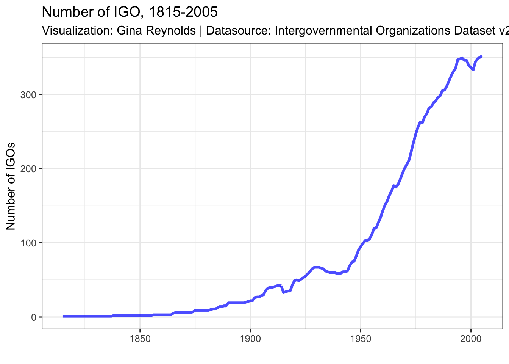
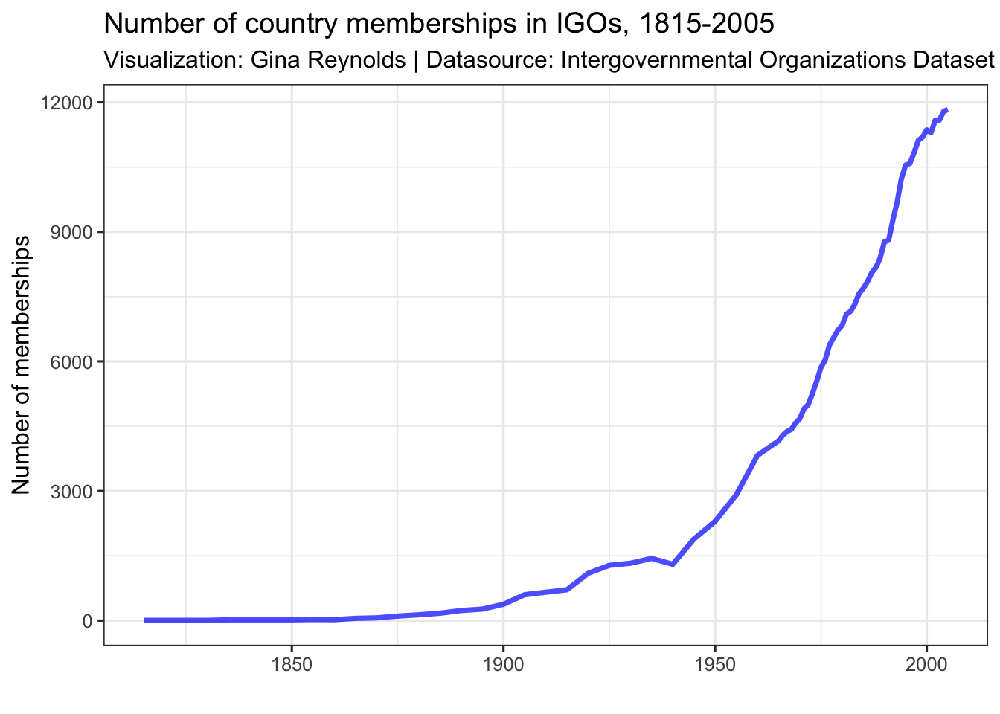
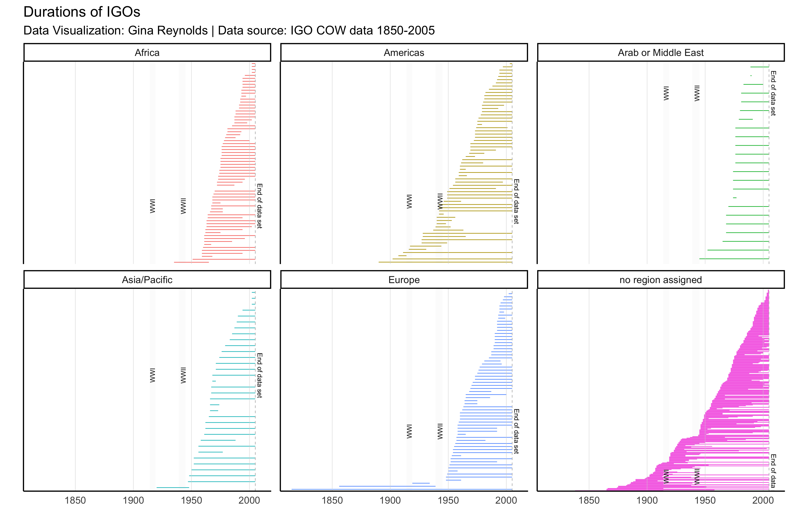

The [International Organization v2.3](http://www.correlatesofwar.org/data-sets/IGOs/international-organization-v2.3) dataset is a rich resource for scholars of international relations.  Tracking the existence of international organizations and country memberships in them, the data's various version have been cited over 450 times.  Version 2.3 covers the time period 1815 to 2005, and records information about 529 IGOs and membership information for over two million country-igo-year observations.  Before 1965, coding was performed only every five years; thereafter information about IGOs and membership is available on an annual basis.  

The project originated with [Michael Wallace and David Singer (1970)](http://www.u.arizona.edu/~volgy/WallaceSinger1970.pdf) and was extended by [Jon Pevehouse, Timothy Nordstrom, and Kevin Warnke](https://www.tandfonline.com/doi/abs/10.1080/07388940490463933?src=recsys&journalCode=ucmp20).  The current inclusion criteria are as follows (quoting the codebook):

- *An IGO must consist of at least three members of the [COW-defined state system](http://www.correlatesofwar.org/data-sets/state-system-membership);*
- *An IGO must hold regular plenary sessions at least once every ten years;*
- *An IGO must possess a permanent secretariat and corresponding headquarters.*

Further information about the creation of the IGO database and inclusion criteria are available in the [codebook](http://www.correlatesofwar.org/data-sets/IGOs/IGO_codebook_v2.1.pdf).

This webpage is meant provide students and the curious with an visual, explorable introduction to the dataset.  

# Growth in IGOs and participation

The number of IGOs observed over the time period of 1815 to 2005 has dramatically increased.  At the beginning of this period there were just a handful, but now they number more than 300.  

The number of IGO-country memberships, likewise has also grown dramatically.   Individual country affiliations with IGOs numbers more than 10,000. 

# Duration of IGOs in Version 2.3

An overview of the durations of all the IGOs in the dataset is shown in the figure below, with the IGOs grouped by regional focus (my own coding).  The IGOs are simply ordered first by the year that they come into existence and second by the year that they disband.  Notice that some regions have created more IGOs than others.  Some regions start forming regional IGOs later on than others too. What are some of the factors that could be driving these differences?         

## Some notes on duration

For IGOs that we observe start to finish in the IGO dataset, the mean number of years is 22.5, but the mean observed duration for any IGO is observed to be 30.7 years.  When we look at only the IGOs that are observed start to finish, we are deleting the "right censored cases" - cases for which we don't know the full duration.  Survival modeling could be helpful at estimating expectations about IGO duration.    

Within regions there the observed (including censured cases) durations varies between 22 and 33 years.  It should be noted, that the later a region becomes active with IGOs, the lower the cap on what we might observe for the mean duration. 

region                 mean duration
--------------------  --------------
Africa                          22.4
Americas                        31.2
Arab or Middle East             28.7
Asia/Pacific                    29.7
Europe                          29.5
no region assigned              33.4

# Exploring IGOs by region

The data can be explored further in the following interactive plots.  Using these plots, we can answer some simple questions about IGOs in the data set.  For example, which IGOs are created in Europe after World War II?  Which are the IGOs not assigned a region that are created in the wake of World War II?  Which disbanded?  1960 is an important year for Africa, with many countries gaining their independence from colonizing states.  Which are the African IGOs that are also formed around this time?

For best results, "mouse-over" the end-points of the IGO representation.    

preserve6bee85faaa653c78preserve6a8f89f60efbd057preserveddd9c186b575770fpreserve61e9013415c76ecapreserve674cde2fb045ffcfpreserve8bdca316d174f4e2

<!-- # Explorable IGO plots, by region -->

<!-- Thus far we've mostly been concerned with IGOs as our "unit-of-inquiry".  But we might also be concerned with the membership in these IGOs.  Are the IGOs small or large?  Does the membership include powerful states?  Do all members join at once or is membership increase gradual?    -->

# Country Membership

We can also look at individual memberships. Below, each of the points contains the information about country membership in a given year. The horizontal lines represent the time period that the membership 

Unfortunately, there is much missing data which is clear from the visualizations.  Recall, too, that membership data is only available every five years before 1965. 

preserved248e1bc9f611a56preservefc73d5b9a1e9fcd3preserve81e7ff5c2e7f8939preserve9656e01a878f6311preserve84bf447bce28eb70preserve4c8b28790b61d690

# More to come

In the future, I hope to add some discussion of how we might think about IGOs as connections between countries, and countries as connections between IGOs.  For now, check out my [IGO Network App](https://evangelinereynolds.shinyapps.io/IGONetwork/), where you can explore connections that IGOs create between countries.  

# References

## Data:

Pevehouse, Jon C., Timothy Nordstrom, and Kevin Warnke. 2004. "The COW-2 International Organizations Dataset Version 2.0," Conflict Management and Peace Science 21:101-119.

Wallace, Michael, and J. David Singer. 1970. "International Governmental Organization in the Global System, 1815-1964." International Organization 24: 239-87. 

## Tooling:

R Core Team (2017). R: A
  language and environment
  for statistical
  computing. R Foundation
  for Statistical
  Computing, Vienna,
  Austria. URL
  https://www.R-project.org/.

Wickham, H. and Chang, W., 2008. ggplot2: An implementation of the Grammar of Graphics. R package version 0.7, URL: http://CRAN. R-project. org/package= ggplot2.

Carson Sievert, Chris Parmer,
  Toby Hocking, Scott
  Chamberlain, Karthik Ram,
  Marianne Corvellec and Pedro
  Despouy (2017). plotly:
  Create Interactive Web
  Graphics via 'plotly.js'. R
  package version 4.7.1.
  https://CRAN.R-project.org/package=plotly

Hadley Wickham, Romain
  Francois, Lionel Henry and
  Kirill Müller (2017). dplyr:
  A Grammar of Data
  Manipulation. R package
  version 0.7.4.
  https://CRAN.R-project.org/package=dplyr

